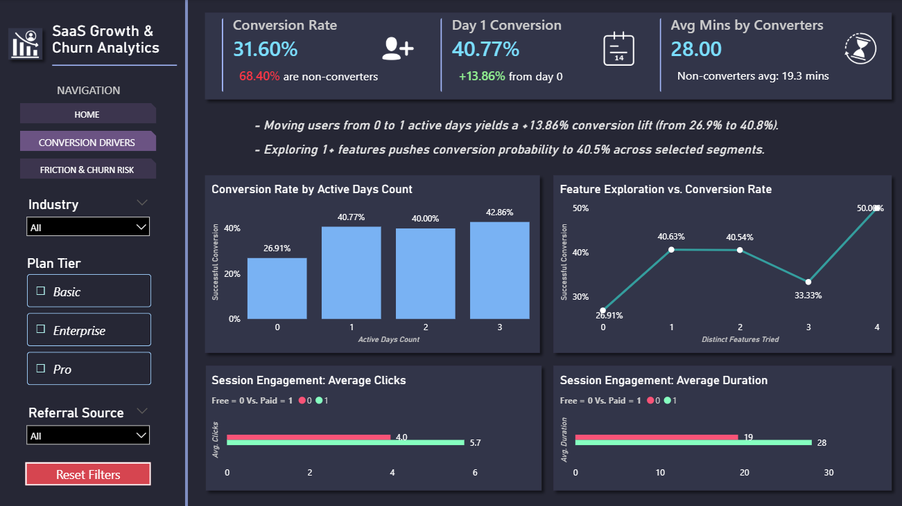
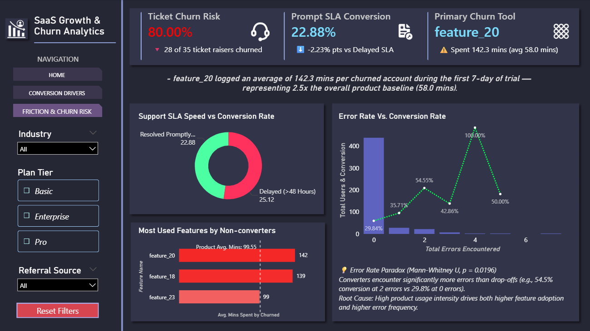

# 📊 SaaS Trial-to-Paid Activation & Churn Analytics

An end-to-end data analytics project diagnosing trial conversion drivers, onboarding bottlenecks, product friction, and support SLAs across **500 enterprise trial accounts** over a strict 14-day window.

* 📜 **Detailed Project Analysis:** [Click here to view the Full Project Report (PDF)](https://github.com/vaibhavpal0226/saas-trial-to-paid-activation-and-churn-analytics/blob/main/SaaS_Trial_to_Paid_Activation_%26_Churn_Analytics.pdf)


---

## 📖 Table of Contents
1. <a href="#project-overview">Project Overview</a>
2. <a href="#problem-statement">Problem Statement</a>
3. <a href="#dataset-information">Dataset Information</a>
4. <a href="#tools-used">Tools Used</a>
5. <a href="#project-structure">Project Structure</a>
6. <a href="#technical-workflow">Technical Workflow</a>
    * <a href="#phase-1-engineering">Phase 1: Data Cleaning & Feature Engineering</a>
    * <a href="#phase-2-eda">Phase 2: Exploratory Data Analysis (EDA) & Hypothesis Testing</a>
    * <a href="#phase-3-powerbi">Phase 3: Power BI Storytelling</a>
7. <a href="#key-business-insights">Key Business Insights</a>
8. <a href="#dashboard-previews">Dashboard Previews</a>
9. <a href="#final-recommendations">Final Recommendations</a>
10. <a href="#detailed-report">Detailed Findings Report</a>
11. <a href="#how-to-run-this-project">How to Run This Project</a>
12. <a href="#note-on-security">Note on Security</a>
13. <a href="#author--contact">Author & Contact</a>

---
<h2 id="project-overview">🎯 Project Overview</h2>

A B2B SaaS platform experienced flatlining trial conversion rates (~31.60%). This project delivers a comprehensive analytical framework combining **feature engineering**, **statistical hypothesis testing**, and an interactive **2-page Power BI executive dashboard** to identify high-leverage activation milestones and mitigate churn risk.

---

<h2 id="problem-statement">❓ Problem Statement</h2>

A SaaS company is experiencing significant drop-offs between free trial signup and paid conversion, leading to lost revenue opportunities. The objective is to identify early behavioral signals and user segments that indicate low conversion likelihood, and recommend targeted  interventions to improve trial-to-paid conversion rates. 

---

<h2 id="dataset-information">📊 Dataset Information</h2>

The underlying database consists of 4 relational tables tracking **500 accounts**:
* `df_accounts`: Customer metadata, signup dates, industry verticals, and acquisition channels.
* `df_subscriptions`: Subscription lifecycles, plan tiers (Basic, Pro, Enterprise), trial flags, and revenue (MRR).
* `df_feature_usage`: Daily product interaction logs, click counts, session durations, and error events. 
* `df_support_tickets`: Ticket submission logs, first response times, resolution durations, and CSAT scores. 
* **Source:** [SaaS Subscription & Churn Analytics Dataset by RIVER](https://www.kaggle.com/datasets/rivalytics/saas-subscription-and-churn-analytics-dataset)

---

<h2 id="tools-used">🛠️ Tools Used</h2>

| Domain | Tools & Technologies | Purpose |
| :--- | :--- | :--- |
| Data Engineering | Python (Pandas, NumPy) | Automated Ingestion, SQLAlchemy, Data Cleaning, Feature Engineering |
| Database | MySQL | Relational Schema, CTEs, Window Functions |
| Data Visualization | Python (Matplotlib, Seaborn) | EDA, Correlation Heatmaps, Outlier Detection, Distributions |
| Statistical Testing | Python (SciPy) | Mann-Whitney U Test, Pearson Correlation ($r$), Chi-Square ($\chi^2$) Test |
| Business Intelligence | Power BI | DAX Measures, Interactive Storytelling, Dynamic Insights, Stakeholder Dashboards |

---

<h2 id="project-structure">📂 Project Structure</h2>

```
├── data/
│   ├── raw/                                                      # Initial 4 relational CSV files (500 accounts)
│   └── processed/                                                # Cleaned & transformed datasets
├── logs/
|   └── ingestion_db.log                   
├── scripts/
│   └── ingestion_db.py                                           # Python script for SQL migration & logging
├── notebooks/
|   ├── data_cleaning.ipynb                                       # Cleaning & Feature Engineering
│   └── exploratory_data_analysis.ipynb                           # Finding Patterns
├── sql/
│   └── trial_conversion.sql                                      # Tables Creation
├── dashboard/
│   └── dashboard_and_storytelling.pbix                           # Multi-page Power BI Dashboard
├── images/
│   |── page_1.png
|   └── page_2.png  
├── SaaS_Trial_to_Paid_Activation_&_Churn_Analytics.pdf           # Detailed project documentation
└── README.md                                                     # Project documentation
```

---

<h2 id="technical-workflow">🏗️ Technical Workflow</h2>

<h3 id="phase-1-engineering">🐍 Phase 1: Data & Feature Engineering</h3>

* **Ingestion:** Developed a Python script with `SQLAlchemy` and `logging` to migrate raw CSVs to MySQL using a standardized `snake_case` schema.
* **Data Cleaning:**
   * Converted all date columns into explicit Pandas datetime64[ns] format (pd.to_datetime).
   * Removed all the product usage logs and support tickets that had dates before the user's official signup date. This ensures our analysis only focuses on real activity that happened while the customer was actually using the free trial.    
* **Feature Engineering:** Created key features like:
   * converted_to_paid (Target Variable): Binary indicator (1 if converted within 0 ≤ days ≤ 14, 0 otherwise). 
   * active_days_count: How many separate days out of the first 7 they actually opened the tool and used it. 
   * distinct_features_tried: Out of the 40 tools available, this counts how many different features they experimented with.  
   * total_errors_encountered: The total number of system errors or software bugs the user hit in their first 7 days. 

<h3 id="phase-2-eda-statistical-testing">🧪 Phase 2: Exploratory Data Analysis (EDA) & Hypothesis Testing</h3>

* Answered business questions like:
   * What is the fundamental trial-to-paid conversion baseline for the platform? 
   * Do session duration and overall click volume correlate with trial conversion? Are user activity metrics normally distributed? 
   * Is technical error density a primary driver of customer drop-off?
   * Does submitting a support ticket signal a risk of trial failure?

* Statistical Testing & Methodology

Hypothesis | Test Applied | P-Value	| Business Insight
| :--- | :--- | :--- | :--- |
| Week 1 vs. Week 2 Usage Drop-off	| Paired T-Test | P=0.9537	| Failed to reject H_0. Non-converters stay flat and inactive across both weeks rather than losing steam over time. |
| High Usage Intensity Drives Conversion	| Mann-Whitney U	| P=0.0036	| Reject H_0. Converters log significantly higher session duration (28.0 mins vs 19.3 mins). |
| Technical Errors Drive Churn	| Mann-Whitney U	| P=0.0196	| Error Paradox: Converters hit more errors because high-intent power users explore deeper, whereas churned users log off before hitting errors. |
| Support Delays Drive Conversion Loss | Mann-Whitney U	| P=0.2416	| Failed to reject H_0. Support resolution delays are not significantly higher for non-converters. Ticket creation itself is the friction event. |
| Support Response Delay vs CSAT | Pearson r | r=-0.0717 (P=0.7336)	| No correlation between response speed and CSAT score. Resolution quality matters far more than raw response time.|
| Survey Avoidance Correlates with Churn	| Chi-Square (χ^2) | P=0.6400	| Failed to reject H_0. Skipping feedback surveys is neutral and does not indicate churn intent. |


<h3 id="phase-3-powerbi">📊 Phase 3: Power BI Storytelling</h3>

Built a 2-page interactive dashboard:

* **🔹 Conversion Drivers**
  * **Baseline Conversion Rate:** 31.60%
  * **Day-1 Activated Conversion Rate:** 40.77%
  * **Avg Active Session Duration:** 28.0 mins

* **🔹 Friction & Churn Risk**
  * **Ticket Churn Risk:** 80.00%
  * **Prompt SLA Lift:** 22.88%
  * **Top High-Risk Feature:** `feature_20`

---

<h2 id="key-business-insights">📈 Key Business Insights</h2>

* **The Day-1 Onboarding Threshold:** Moving a trial user from 0 to 1 active day increases conversion probability from **26.91% to 40.77% (+13.86% lift)**. Trying 1–2 distinct features stabilizes trial conversion above **40.63%**.
* **The "Free Value Trap" (`feature_20`):** Non-converting accounts generate **77.25% of overall app usage events** (9,117 events). Non-converters heavily exploit `feature_20` (averaging 49.0 clicks and 82.99 mins duration) to extract value before abandoning the trial without paying.
* **The Error Rate Paradox:** Statistical hypothesis testing (**Mann-Whitney U, $P = 0.0196$**) proved that converting users hit *more* errors than non-converters. Technical errors serve as a proxy for high engagement—serious buyers test complex workflows, while churned users log off before encountering bugs.
* **Support Ticket Drop-Off Red Flag:** Submitting a support ticket carries an **82.35% churn risk**. However, response delays ($P = 0.2416$) and CSAT ratings ($P = 0.7336$) show zero statistical correlation with churn—the ticket submission itself indicates core onboarding friction.
* **Mid-Tier Packaging Bottleneck:** While the Basic plan achieves a **53.57% conversion rate** in EdTech, the Pro tier underperforms significantly across DevTools (23.81%) and HealthTech (20.00%).

---

<h2 id="dashboard-previews">📊 Dashboard Previews</h2>

### **Page 1: Conversion Drivers**


### **Page 2: Friction & Churn Risk**


---

<h2 id="final-recommendations">🏁 Final Recommendations</h2>

* Trigger automated email and in-app push notifications, contextual tooltips, and banner 
announcements when an account registers zero active clicks within 24 hours of signing 
up. 
* Build guided walkthroughs that force new users to interact with at least 2 core features 
during their first login to cross the 20-minute engagement milestone. 
* Invest in contextual in-app guidance, embedding instant AI chatbots, and fixing core 
product bugs so users never hit blockers that force them to submit a ticket. 
* Place usage limits on high-utility features like feature_20 and feature_18. Allow 3–5 free 
uses before requiring a paid upgrade, converting high-usage non-converters into paying 
subscribers. 
* Restructure the Pro plan's features and price point to create a clearer bridge between 
Basic and Enterprise. 
* Shift marketing budget away from events and partnerships (which suffer ~28% churn) 
toward high-intent Organic and Paid Search channels.

---

<h2 id="detailed-report">📄 Detailed Findings Report</h2>

*For a detailed breakdown of the findings, please refer to the [SaaS_Trial_to_Paid_Activation_&_Churn_Analytics](https://github.com/vaibhavpal0226/saas-trial-to-paid-activation-and-churn-analytics/blob/main/SaaS_Trial_to_Paid_Activation_%26_Churn_Analytics.pdf).*

---

<h2 id="how-to-run-this-project">⚙️ How to Run This Project</h2>

1. **Clone the Repository**
Open your terminal or command prompt and run:
```bash
git clone https://github.com/vaibhavpal0226/saas-trial-to-paid-activation-and-churn-analytics.git

```

2. **Database Setup:**
   * Create a MySQL database named `saas_conversion`.
   * Update the connection string in `ingestion_db.py` with your username and password. Also update log_directory and target_folder.
3. **Environment:**
   * Install dependencies: `pip install pandas numpy scipy sqlalchemy mysql-connector-python matplotlib seaborn`.
4. **Data Pipeline:**
   * Run `ingestion_db.py` to load data into SQL.
   * Execute `data_cleaning.ipynb` to process and clean the data.
5. **Analysis:**
   * Run `trial_conversion.sql` in your MySQL Workbench to generate tables.
   * Open `exploratory_data_analysis.ipynb` for statistical visualizations and testing.
6. **Dashboard:**
   * Open `trial_conversion.pbix` in **Power BI Desktop** to explore the interactive report.
   * **Note:** To view the Power BI dashboard with your data, go to **Transform Data > Data Source Settings** and update the server/database to match your local MySQL environment.

---

<h2 id="note-on-security">🔒 Note on Security</h2>

Database credentials have been removed for security. Users can replicate the environment by substituting their own credentials in the connection strings.

---

<h2 id="author--contact">👤 Author & Contact</h2>

**Vaibhav Pal** <br>
Aspiring Data Analyst
* Email: vaibhav2021official@gmail.com
* LinkedIn: https://www.linkedin.com/in/vaibhav-pal26/
* Portfolio: https://github.com/vaibhavpal0226

---
